# Proyecto 1 GRUPO 23
# MANUAL DE USUARIO
---------------------------------------------------------------------------
### INTEGRANTES
- ERICK VALENZUELA
- DIEGO RENE MOLINA
---------------------------------------------------------------------------
### REQUERIMIENTOS
- Tener Instaldo un navegador web (Google Chrome, Edge, Firefox, etc).
---
### COMPONENTES DE LA APLICACION 
- Espacio de trabajo principal

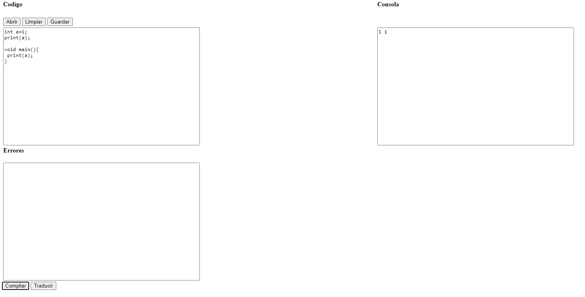

 

- botones de funcionalidades Abri, limpiar, guardar

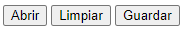

 

- botones de compilar y traducir

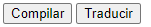

 

- Area de texto codigo de entrada

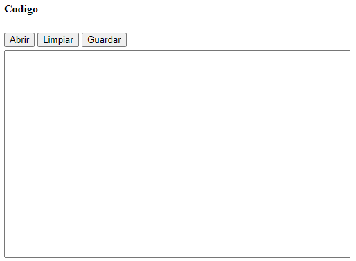

 

- area de texto codigo compilado y traduccion

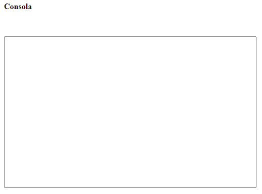

 

- Area de texto Errores

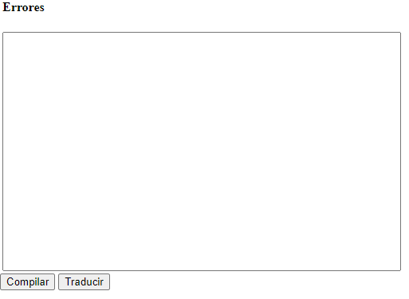

 

### UTILIZACION DEL COMPILDOR QUETZAL

Para poder hacer uso del copilar del lenguaje quetzal se debe de tener claro el flujo de la aplicacion, el cual se describe a continuacion.

- Interpreta: Esta opción nos va a permitir interpretar una entrada. El programa recibe un archivo de entrada de código de alto nivel y ejecuta las instrucciones.
- Traducir: Esta opción nos va a permitir traducir una entrada. El programa recibe un archivo de entrada de código de alto nivel y traduce a código intermedio en la sintaxis de tres direcciones.
- Reportes: Esta opción nos va a permitir visualizar los reportes generados después de traducir una entrada.

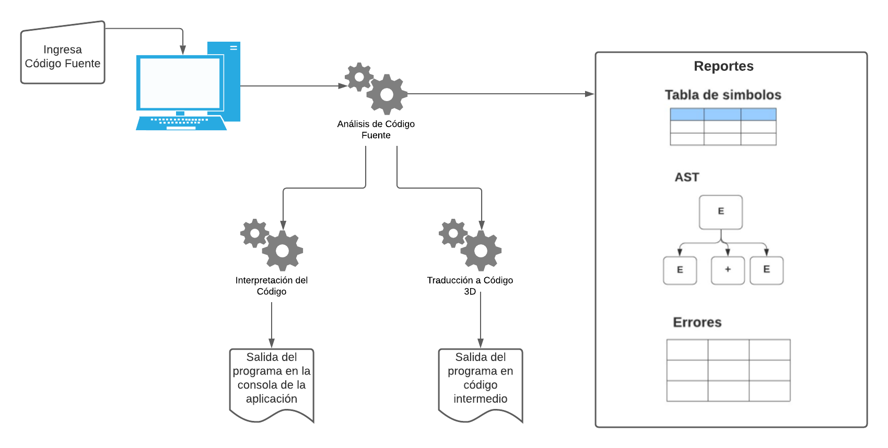

 

- Para poder compilar un codigo lo primero que debemos de realizar es el ingreso de algun archivo de entrada o escribir algun codigo que sea aceptado por el compilador para que este pueda ser ejecutado de la mejor manera, este codigo debe de ser agregado en el apartado de codigo y luego dar en el boton de compilar.

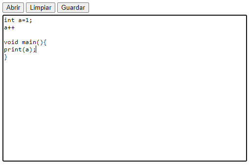

 

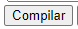

 

- al realizar el paso anterior se mos desplegara el resultado en el apartado de consola

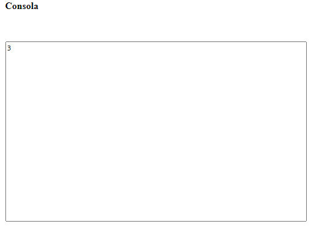

 

- asi tambien para poder generar la traduccion a codigo de tres direcciones solo debemos pulsar el boton traducir y nos generara la traduccion

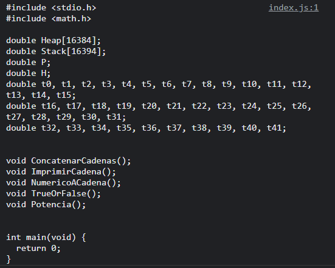

 